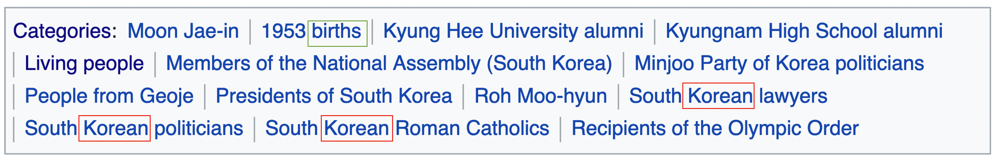

## NaNa Dataset

NaNa---Name to Nationality---is a simple dataset that maps names and nationalities.
It contains {train,dev,test}.{src,tgt} files.
Each line in the *.src files and *.tgt files have a name and its associated nationality, respectively.

### Construction
I constructed a new dataset for this project because I failed to find any available dataset that is big and comprehensive enough.

* STEP 1. Downloaded and extracted the 20200601 English wiki dump (enwiki-20200601-pages-articles.xml).
* STEP 2. Iterated all pages and collected the title and the nationality. 
I regarded the title as a person if the Category section at the bottom of each page included ... births (green rectangule),
and identified their nationality from the most frequent nationality word in the section (red rectangules).

* STEP 3. Randomly split the data into train/dev/test in the ratio of 8:1:1 within each nationality group.

### Stats
| Nationality | Train | Dev | Test | 
|--|--|--|--|
|Total 1112902 | 890248 |111286|111368|
| Afghan | 778 | 97 | 98 |
| Albanian | 2193 | 274 | 275 |
| Algerian | 1592 | 199 | 200 |
| American | 241772 | 30221 | 30222 |
| Andorran | 188 | 24 | 24 |
| Angolan | 504 | 63 | 63 |
| Argentine | 8926 | 1116 | 1116 |
| Armenian | 1600 | 200 | 201 |
| Aruban | 93 | 12 | 12 |
| Australian | 40536 | 5067 | 5067 |
| Austrian | 9192 | 1149 | 1149 |
| Azerbaijani | 1331 | 166 | 167 |
| Bahamian | 233 | 29 | 30 |
| Bahraini | 237 | 30 | 30 |
| Bangladeshi | 1636 | 204 | 205 |
| Barbadian | 372 | 47 | 47 |
| Basque | 961 | 120 | 121 |
| Belarusian | 2338 | 292 | 293 |
| Belgian | 7907 | 988 | 989 |
| Belizean | 148 | 19 | 19 |
| Beninese | 199 | 25 | 25 |
| Bermudian | 270 | 34 | 34 |
| Bhutanese | 144 | 18 | 18 |
| Bolivian | 657 | 82 | 83 |
| Bosniak | 81 | 10 | 11 |
| Botswana | 252 | 31 | 32 |
| Brazilian | 11234 | 1404 | 1405 |
| Breton | 118 | 15 | 15 |
| British | 45922 | 5740 | 5741 |
| Bruneian | 115 | 14 | 15 |
| Bulgarian | 3926 | 491 | 491 |
| Burkinabé | 289 | 36 | 37 |
| Burmese | 944 | 118 | 118 |
| Burundian | 140 | 17 | 18 |
| Cambodian | 360 | 45 | 46 |
| Cameroonian | 1028 | 129 | 129 |
| Canadian | 34152 | 4269 | 4270 |
| Catalan | 1717 | 215 | 215 |
| Chadian | 139 | 17 | 18 |
| Chilean | 2838 | 355 | 355 |
| Chinese | 9494 | 1187 | 1187 |
| Colombian | 2620 | 328 | 328 |
| Comorian | 54 | 7 | 7 |
| Congolese | 35 | 4 | 5 |
| Cuban | 1938 | 242 | 243 |
| Cypriot | 1016 | 127 | 128 |
| Czech | 7244 | 906 | 906 |
| Dane | 32 | 4 | 5 |
| Djiboutian | 54 | 7 | 7 |
| Dominican | 1580 | 198 | 198 |
| Dutch | 14916 | 1864 | 1865 |
| Ecuadorian | 874 | 109 | 110 |
| Egyptian | 2776 | 347 | 348 |
| Emirati | 621 | 78 | 78 |
| English | 77159 | 9645 | 9645 |
| Equatoguinean | 193 | 24 | 25 |
| Eritrean | 133 | 17 | 17 |
| Estonian | 2028 | 254 | 254 |
| Ethiopian | 733 | 92 | 92 |
| Faroese | 284 | 35 | 36 |
| Filipino | 3928 | 491 | 491 |
| Finn | 68 | 8 | 9 |
| French | 40841 | 5105 | 5106 |
| Gabonese | 180 | 23 | 23 |
| Gambian | 220 | 28 | 28 |
| Georgian | 262 | 33 | 33 |
| German | 42388 | 5299 | 5299 |
| Ghanaian | 2036 | 255 | 255 |
| Gibraltarian | 98 | 12 | 13 |
| Greek | 5975 | 747 | 747 |
| Grenadian | 139 | 17 | 18 |
| Guatemalan | 563 | 70 | 71 |
| Guinean | 584 | 73 | 74 |
| Guyanese | 358 | 45 | 45 |
| Haitian | 561 | 70 | 71 |
| Honduran | 500 | 63 | 63 |
| Hungarian | 7220 | 903 | 903 |
| I-Kiribati | 40 | 5 | 6 |
| Indian | 22692 | 2836 | 2837 |
| Indonesian | 2820 | 352 | 353 |
| Iranian | 5010 | 626 | 627 |
| Iraqi | 1252 | 157 | 157 |
| Irish | 11844 | 1481 | 1481 |
| Israeli | 5149 | 644 | 644 |
| Italian | 29336 | 3667 | 3668 |
| Jamaican | 1422 | 178 | 178 |
| Japanese | 21216 | 2652 | 2652 |
| Jordanian | 490 | 61 | 62 |
| Kazakh | 24 | 3 | 4 |
| Kenyan | 1609 | 201 | 202 |
| Korean | 7896 | 987 | 988 |
| Kuwaiti | 396 | 50 | 50 |
| Kyrgyz | 16 | 2 | 2 |
| Lao | 26 | 3 | 4 |
| Latvian | 1693 | 212 | 212 |
| Lebanese | 1246 | 156 | 156 |
| Liberian | 294 | 37 | 37 |
| Libyan | 271 | 34 | 34 |
| Lithuanian | 1979 | 247 | 248 |
| Macedonian | 1099 | 137 | 138 |
| Malagasy | 232 | 29 | 29 |
| Malawian | 219 | 27 | 28 |
| Malaysian | 2582 | 323 | 323 |
| Maldivian | 152 | 19 | 20 |
| Malian | 385 | 48 | 49 |
| Maltese | 663 | 83 | 83 |
| Manx | 150 | 19 | 19 |
| Marshallese | 32 | 4 | 4 |
| Mauritanian | 96 | 12 | 12 |
| Mauritian | 263 | 33 | 33 |
| Mexican | 8648 | 1081 | 1081 |
| Moldovan | 1000 | 125 | 125 |
| Mongolian | 504 | 63 | 64 |
| Montenegrin | 955 | 119 | 120 |
| Moroccan | 1457 | 182 | 183 |
| Mozambican | 210 | 26 | 27 |
| Namibian | 588 | 74 | 74 |
| Nauruan | 32 | 4 | 4 |
| Nepalese | 773 | 97 | 97 |
| Nicaraguan | 285 | 36 | 36 |
| Nigerian | 4060 | 507 | 508 |
| Nigerien | 143 | 18 | 18 |
| Norwegian | 13512 | 1689 | 1690 |
| Omani | 197 | 25 | 25 |
| Pakistani | 3762 | 470 | 471 |
| Palauan | 35 | 4 | 5 |
| Palestinian | 528 | 66 | 66 |
| Panamanian | 474 | 59 | 60 |
| Paraguayan | 1012 | 127 | 127 |
| Peruvian | 1521 | 190 | 191 |
| Portuguese | 4734 | 592 | 592 |
| Qatari | 548 | 68 | 69 |
| Romanian | 6551 | 819 | 819 |
| Russian | 21274 | 2659 | 2660 |
| Rwandan | 269 | 34 | 34 |
| Salvadoran | 507 | 63 | 64 |
| Sammarinese | 198 | 25 | 25 |
| Samoan | 596 | 75 | 75 |
| Saudi | 1496 | 187 | 188 |
| Senegalese | 823 | 103 | 103 |
| Serb | 44 | 6 | 6 |
| Singaporean | 1316 | 165 | 165 |
| Slovak | 2867 | 358 | 359 |
| Slovene | 88 | 11 | 12 |
| Somali | 116 | 14 | 15 |
| Sotho | 49 | 6 | 7 |
| Sudanese | 348 | 44 | 44 |
| Surinamese | 200 | 25 | 25 |
| Swazi | 114 | 14 | 15 |
| Syriac | 78 | 10 | 10 |
| Syrian | 1047 | 131 | 131 |
| Taiwanese | 1946 | 243 | 244 |
| Tajik | 61 | 8 | 8 |
| Tamil | 1399 | 175 | 175 |
| Tanzanian | 627 | 78 | 79 |
| Thai | 2747 | 343 | 344 |
| Tibetan | 265 | 33 | 34 |
| Togolese | 211 | 26 | 27 |
| Tongan | 456 | 57 | 57 |
| Tunisian | 1072 | 134 | 134 |
| Turk | 79 | 10 | 10 |
| Tuvaluan | 66 | 8 | 9 |
| Ugandan | 1052 | 132 | 132 |
| Ukrainian | 6198 | 775 | 775 |
| Uruguayan | 2267 | 283 | 284 |
| Uzbek | 62 | 8 | 8 |
| Vanuatuan | 116 | 15 | 15 |
| Venezuelan | 1937 | 242 | 243 |
| Vietnamese | 1257 | 157 | 158 |
| Vincentian | 8 | 1 | 1 |
| Welsh | 5270 | 659 | 659 |
| Yemeni | 322 | 40 | 41 |
| Zambian | 510 | 64 | 64 |

### License
Apache License 2.0 

### Relevant Project
* [name2nat](https://github.com/kyubyong/name2nat)

### Author

Kyubyong Park (kbpark.linguist@gmail.com)